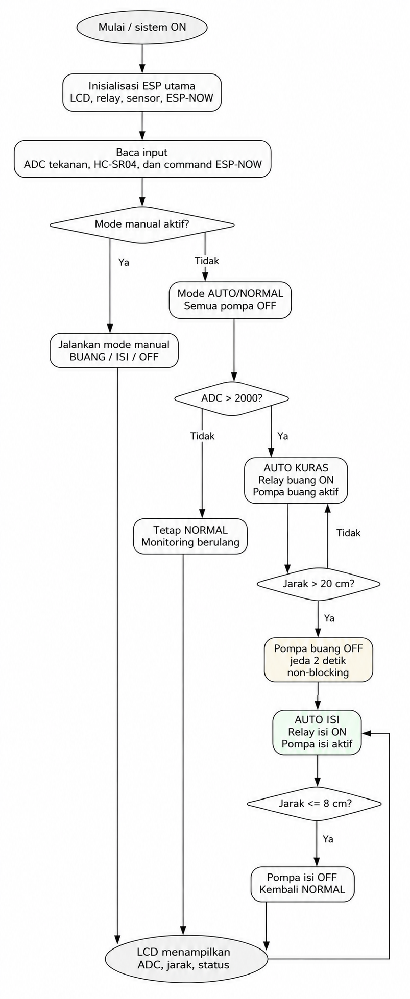
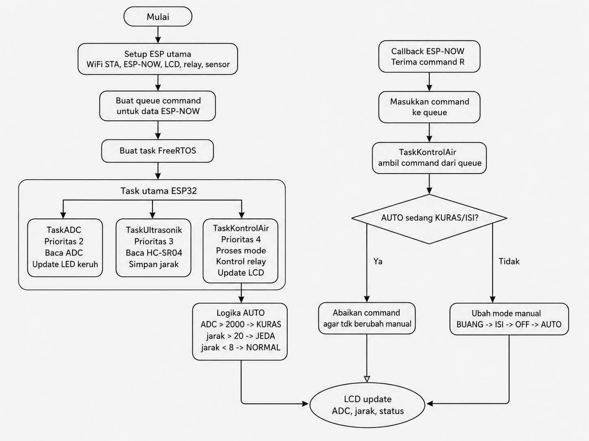
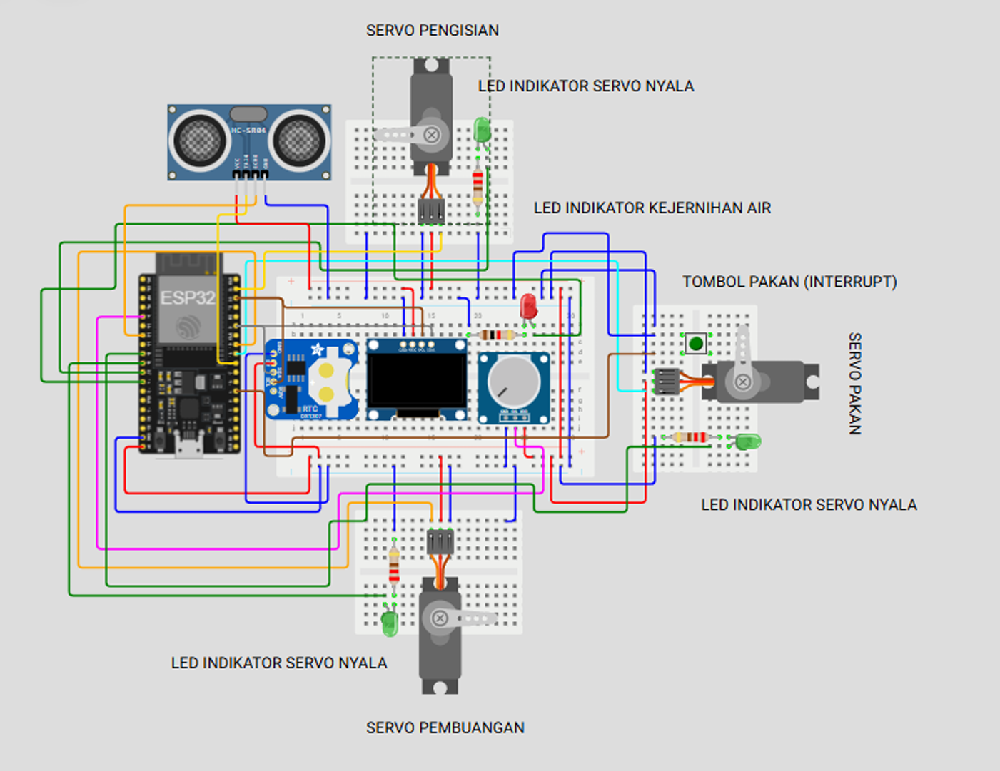
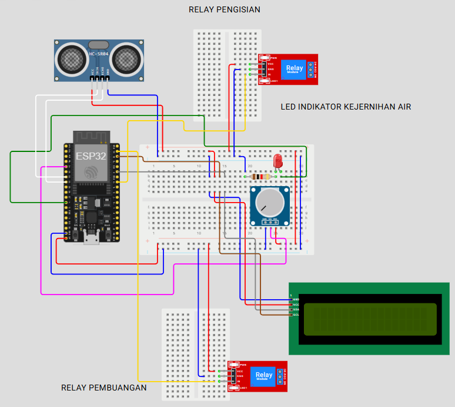
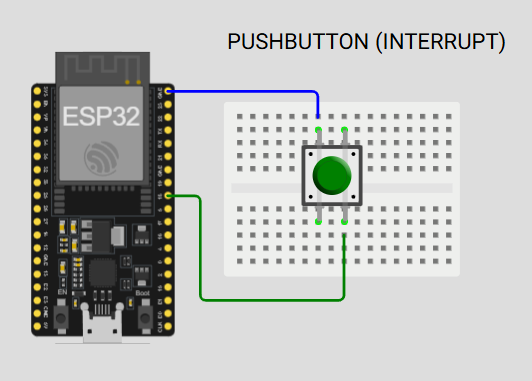
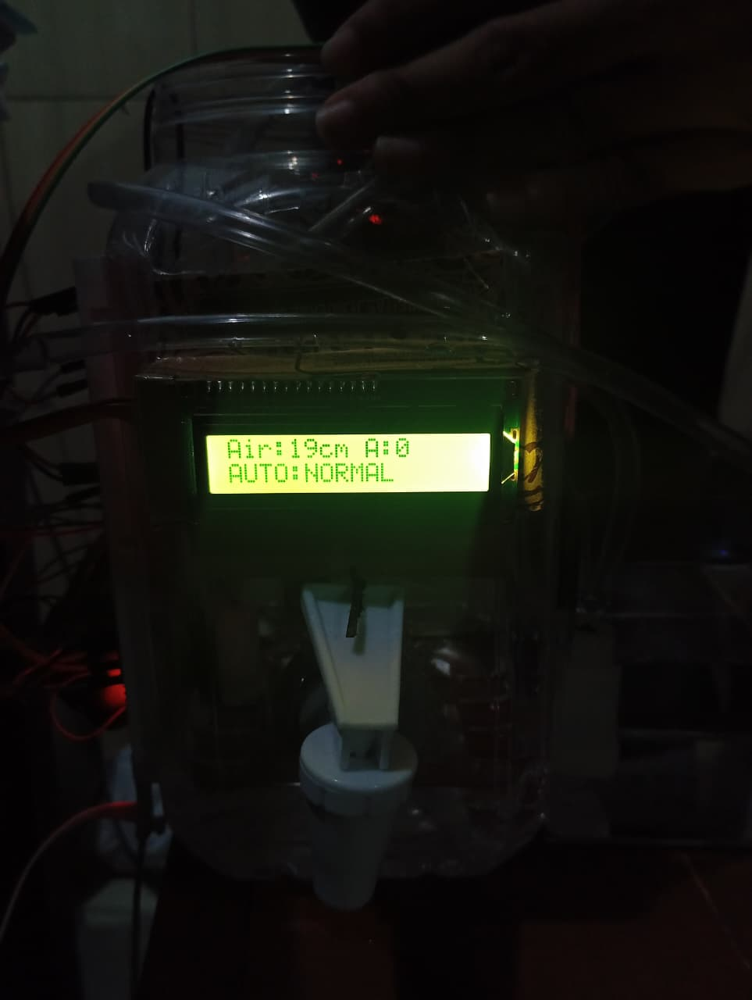

# PROJECT AKHIR PRAKTIKUM SISTEM MIKROKONTROLER

## Identitas Kelompok:

| Keterangan | Isi |
|---|---|
| Kelas | A |
| Nama Kelompok | 3 |
| Topik Proyek | Sistem Perawatan Kolam Otomatis Berbasis ESP32 dengan RTOS |

---

## Identitas Anggota Kelompok:

| No | Nama Anggota | NIM |
|---|---|---|
| 1 | Diva Syahita Mawarni  | H1H024015 |
| 2 | Afif Nur Rahman | H1H024016 |
| 3 | Hana Nur Fathiyyah | H1H024017 |
| 4 | Ardina Jihan Mariska | H1H024018 |
| 5 | Difa’ Tamaya Maulidina Adz Dzikro | H1H024019 |
| 6 | Kaira Meilasya Nayada | H1H024020|
| 7 | Alma Maida Wirastuti | H1H024021 |

---

## Deskripsi Sistem

Sistem Perawatan Kolam Otomatis Berbasis ESP32 dengan RTOS merupakan proyek mikrokontroler yang dirancang untuk membantu proses perawatan air pada kolam atau akuarium secara otomatis. Sistem ini bekerja dengan membaca kondisi air melalui potensiometer sebagai simulasi sensor kekeruhan, membaca level air menggunakan sensor ultrasonik HC-SR04, serta mengontrol pompa buang dan pompa isi menggunakan relay 2 channel.

Pada proyek ini digunakan dua ESP32. ESP32 utama berfungsi sebagai pusat kontrol yang menangani pembacaan sensor, pengendalian relay, tampilan LCD I2C, komunikasi ESP-NOW, dan pembagian task menggunakan FreeRTOS. ESP32 kedua digunakan sebagai remote manual berbasis tombol interrupt untuk mengirim perintah ke ESP32 utama melalui ESP-NOW.

Sistem ini memiliki dua mode kerja, yaitu mode otomatis dan mode manual. Pada mode otomatis, sistem akan menguras air ketika nilai kekeruhan melewati batas tertentu, kemudian mengisi kembali air ketika level air sudah rendah. Pada mode manual, pengguna dapat mengubah mode kerja alat melalui tombol pada ESP32 kedua.

---

## Latar Belakang

Perawatan kolam atau akuarium membutuhkan pemantauan kondisi air secara berkala. Jika air terlalu keruh dan tidak segera diganti, kualitas lingkungan hidup ikan dapat menurun. Proses penggantian air secara manual juga membutuhkan waktu dan perhatian pengguna.

Berdasarkan permasalahan tersebut, dibuat sistem perawatan kolam otomatis berbasis ESP32. Sistem ini dirancang agar mampu mendeteksi kondisi air, mengontrol pompa buang dan pompa isi, serta menampilkan status sistem secara langsung melalui LCD. Penggunaan ESP-NOW bertujuan untuk memisahkan tombol manual dari rangkaian utama agar lebih stabil dari gangguan noise pompa.

---

## Tujuan Proyek

Tujuan dari proyek ini adalah:

1. Membuat prototype sistem perawatan kolam atau akuarium otomatis berbasis ESP32.
2. Membaca nilai kekeruhan air menggunakan potensiometer sebagai simulasi sensor kekeruhan.
3. Membaca level air menggunakan sensor ultrasonik HC-SR04.
4. Mengontrol pompa buang dan pompa isi menggunakan relay 2 channel.
5. Menampilkan nilai sensor dan status kerja alat melalui LCD I2C.
6. Menggunakan ESP-NOW sebagai komunikasi nirkabel antara ESP32 utama dan ESP32 kedua.
7. Menerapkan FreeRTOS pada ESP32 utama agar proses pembacaan sensor dan kontrol relay lebih terstruktur.

---

## Komponen yang Digunakan

| No | Komponen                      |           Jumlah | Fungsi                                                           |
| -- | ----------------------------- | ---------------: | ---------------------------------------------------------------- |
| 1  | ESP32 utama                   |                1 | Pusat kontrol sensor, relay, LCD, ESP-NOW receiver, dan FreeRTOS |
| 2  | ESP32 kedua                   |                1 | Pengirim perintah manual melalui tombol interrupt                |
| 3  | LCD 16x2 I2C                  |                1 | Menampilkan nilai sensor dan status sistem                       |
| 4  | Potensiometer                 |                1 | Simulasi sensor kekeruhan air                                    |
| 5  | Sensor ultrasonik HC-SR04     |                1 | Membaca jarak permukaan air                                      |
| 6  | Relay 2 channel               |                1 | Mengontrol pompa buang dan pompa isi                             |
| 7  | Pompa DC 3–5V                 |                2 | Pompa buang dan pompa isi                                        |
| 8  | LED indikator                 |                3 | Indikator pompa buang, pompa isi, dan kekeruhan                  |
| 9  | Push button                   |                1 | Input manual pada ESP32 kedua                                    |
| 10 | Resistor dan kapasitor        | Sesuai kebutuhan | Stabilisasi tombol dan pembatas arus LED                         |
| 11 | Breadboard dan jumper         | Sesuai kebutuhan | Media perakitan rangkaian                                        |
| 12 | Catu daya / USB / modul power | Sesuai kebutuhan | Sumber daya ESP32, relay, dan pompa                              |

---

## Skema Pin ESP32 Utama

| Komponen      | Pin ESP32 | Keterangan                    |
| ------------- | --------- | ----------------------------- |
| Potensiometer | GPIO34    | Input ADC kekeruhan           |
| LED buang     | GPIO26    | Indikator pompa buang         |
| LED isi       | GPIO27    | Indikator pompa isi           |
| LED keruh     | GPIO14    | Indikator PWM nilai kekeruhan |
| Relay buang   | GPIO19    | Output relay pompa buang      |
| Relay isi     | GPIO23    | Output relay pompa isi        |
| HC-SR04 TRIG  | GPIO32    | Trigger sensor ultrasonik     |
| HC-SR04 ECHO  | GPIO33    | Input echo sensor ultrasonik  |
| LCD SDA       | GPIO21    | Jalur data I2C                |
| LCD SCL       | GPIO22    | Jalur clock I2C               |

> Catatan: Pin ECHO pada HC-SR04 umumnya menghasilkan sinyal 5V, sedangkan ESP32 bekerja pada 3,3V. Oleh karena itu, disarankan menggunakan pembagi tegangan atau level shifter pada pin ECHO.

---

## Skema Pin ESP32 Kedua

| Komponen    | Pin ESP32      | Keterangan                                      |
| ----------- | -------------- | ----------------------------------------------- |
| Push button | GPIO13         | Tombol interrupt untuk mengirim command ESP-NOW |
| GND tombol  | GND            | Tombol dihubungkan ke ground                    |
| ESP-NOW     | Wi-Fi mode STA | Mengirim command ke ESP32 utama                 |

---

## Diagram Alur Kerja Alat



---

## Diagram Alur Program




---

## Cara Kerja Sistem

Saat sistem dinyalakan, ESP32 utama melakukan inisialisasi LCD, relay, sensor ultrasonik, ADC, dan ESP-NOW. Status awal sistem adalah `AUTO:NORMAL`, dengan seluruh pompa dalam keadaan mati.

Pada mode otomatis, ESP32 utama membaca nilai ADC dari potensiometer. Jika nilai ADC melewati batas kekeruhan, maka sistem masuk ke mode `AUTO:KURAS`. Pada mode ini, relay buang aktif sehingga pompa buang menyala.

Sensor ultrasonik HC-SR04 digunakan untuk membaca level air. Ketika jarak air sudah melewati batas kuras, pompa buang dimatikan dan sistem masuk ke jeda sebelum pengisian. Setelah jeda selesai, relay isi aktif dan pompa isi menyala. Ketika level air sudah mencapai batas penuh, pompa isi dimatikan dan sistem kembali ke `AUTO:NORMAL`.

Pada mode manual, tombol pada ESP32 kedua mengirim command ke ESP32 utama melalui ESP-NOW. Setiap command akan mengubah mode secara berurutan:

```text
AUTO -> MANUAL:BUANG -> MANUAL:ISI -> MANUAL:OFF -> AUTO
```

Program juga diberi proteksi agar command manual diabaikan ketika sistem otomatis sedang menjalankan proses `KURAS` atau `ISI`.

---

## Fitur Alat

### 1. Deteksi Kekeruhan Air

Sistem membaca nilai ADC dari potensiometer sebagai simulasi sensor kekeruhan. Jika nilai ADC melebihi batas tertentu, sistem menganggap air dalam kondisi keruh dan memulai proses pengurasan.

### 2. Pembacaan Level Air

Sensor ultrasonik HC-SR04 digunakan untuk membaca jarak antara sensor dan permukaan air. Nilai jarak ini digunakan untuk menentukan kapan pompa buang dimatikan dan kapan pompa isi dihentikan.

### 3. Pengurasan Air Otomatis

Jika air dianggap keruh, relay buang akan aktif dan pompa buang menyala untuk mengurangi volume air dalam kolam atau akuarium.

### 4. Pengisian Air Otomatis

Setelah air berkurang sampai batas tertentu, pompa buang dimatikan, sistem menunggu beberapa detik, kemudian pompa isi dinyalakan untuk mengisi air kembali.

### 5. Mode Manual

Mode manual memungkinkan pengguna mengontrol sistem melalui tombol pada ESP32 kedua. Mode manual terdiri dari:

* `MANUAL:BUANG`
* `MANUAL:ISI`
* `MANUAL:OFF`

### 6. Komunikasi ESP-NOW

ESP-NOW digunakan untuk mengirim command dari ESP32 kedua ke ESP32 utama tanpa menggunakan router. Dengan cara ini, tombol manual dapat dipisahkan dari rangkaian utama agar lebih stabil dari gangguan noise pompa.

### 7. FreeRTOS

FreeRTOS digunakan pada ESP32 utama untuk membagi program menjadi beberapa task, yaitu:

* `TaskADC`
* `TaskUltrasonik`
* `TaskKontrolAir`

Pembagian task membuat program lebih terstruktur dan responsif.

### 8. Tampilan LCD I2C

LCD I2C menampilkan nilai jarak air, nilai ADC, dan status sistem seperti:

* `AUTO:NORMAL`
* `AUTO:KURAS`
* `AUTO:JEDA ISI`
* `AUTO:ISI`
* `MANUAL:BUANG`
* `MANUAL:ISI`
* `MANUAL:OFF`

---

## Cara Upload Program

### Upload Program ESP32 Utama

1. Buka file `espUTAMA.ino`.
2. Pilih board ESP32 pada Arduino IDE.
3. Pilih port ESP32 utama.
4. Upload program.
5. Buka Serial Monitor.
6. Catat MAC Address ESP32 utama.

### Upload Program ESP32 Kedua

1. Buka file `espDUA.ino`.
2. Masukkan MAC Address ESP32 utama ke bagian alamat receiver.
3. Pilih port ESP32 kedua.
4. Upload program.
5. Buka Serial Monitor.
6. Pastikan ESP32 kedua siap mengirim command.

---

## Cara Pengujian

| No | Bagian yang Diuji | Cara Pengujian                              | Hasil yang Diharapkan                                      |
| -- | ----------------- | ------------------------------------------- | ---------------------------------------------------------- |
| 1  | LCD I2C           | Menyalakan sistem dan melihat tampilan LCD  | LCD menampilkan nilai air, ADC, dan status                 |
| 2  | Potensiometer     | Memutar potensiometer                       | Nilai ADC berubah                                          |
| 3  | HC-SR04           | Mengubah jarak objek di depan sensor        | Nilai jarak berubah                                        |
| 4  | Relay buang       | Masuk mode manual buang                     | Relay buang aktif dan pompa buang menyala                  |
| 5  | Relay isi         | Masuk mode manual isi                       | Relay isi aktif dan pompa isi menyala                      |
| 6  | ESP-NOW           | Menekan tombol ESP32 kedua                  | ESP32 utama menerima command                               |
| 7  | Mode otomatis     | ADC dibuat lebih dari batas keruh           | Sistem masuk ke mode KURAS                                 |
| 8  | Integrasi penuh   | Simulasikan air keruh dan level air berubah | Sistem berpindah NORMAL, KURAS, JEDA ISI, ISI, lalu NORMAL |

---

## Dokumentasi Sistem

### Foto Skematik Sistem

Skema awal



---

Skema Akhir





---

### Foto Tampilan LCD



---

## Kendala dan Solusi

Kendala utama pada proyek ini adalah noise dari pompa DC 3–5V. Ketika pompa menyala, tombol interrupt yang awalnya berada pada ESP32 utama dapat ter-trigger sendiri. Akibatnya, mode sistem dapat berubah tanpa tombol ditekan.

Solusi yang diterapkan adalah memindahkan tombol manual ke ESP32 kedua dan menggunakan ESP-NOW sebagai jalur komunikasi. Dengan cara ini, tombol tidak lagi berada dekat dengan rangkaian relay dan pompa. Pada ESP32 utama, command ESP-NOW juga tidak langsung mengubah relay, tetapi dimasukkan ke queue dan diproses oleh `TaskKontrolAir`.

---

## Kesimpulan

Sistem Perawatan Kolam Otomatis Berbasis ESP32 dengan RTOS berhasil dirancang untuk membaca simulasi kekeruhan air, membaca level air, mengontrol pompa buang dan pompa isi melalui relay, serta menampilkan status sistem pada LCD. Penggunaan dua ESP32 dengan komunikasi ESP-NOW membuat tombol manual lebih stabil karena terpisah dari rangkaian utama yang dekat dengan relay dan pompa. FreeRTOS pada ESP32 utama membantu membagi proses pembacaan sensor dan kontrol aktuator agar sistem lebih terstruktur dan responsif.

---
